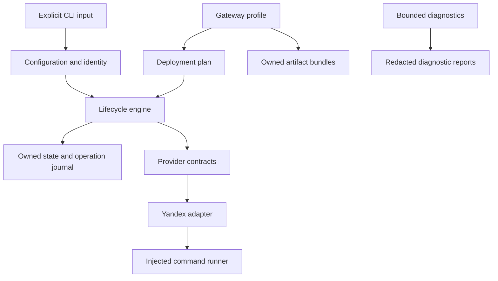
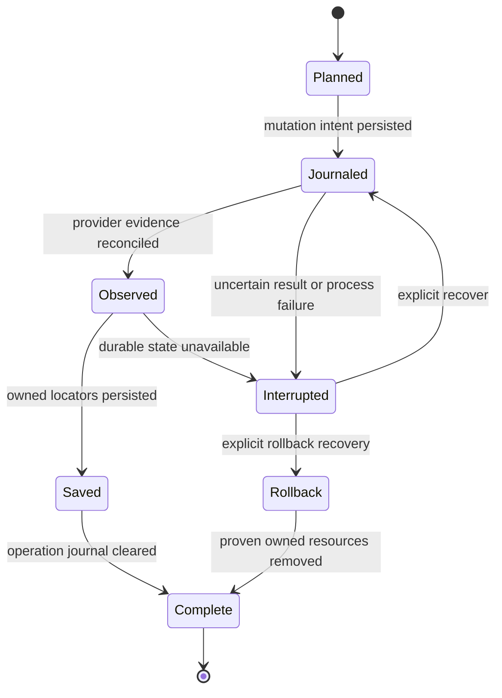
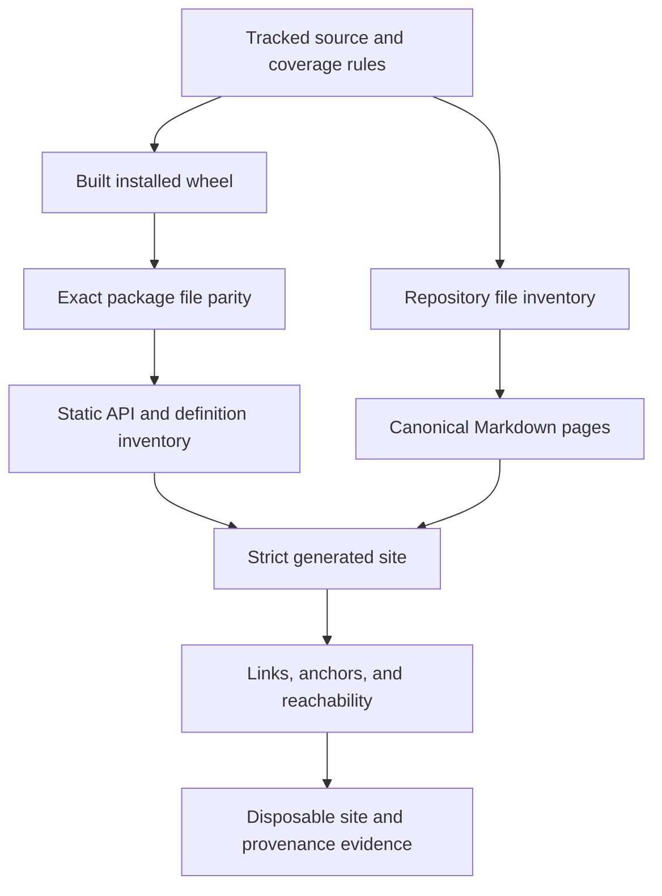

# Implemented architecture reference

This reference describes the stable contracts currently present in source.
[API discovery](../development/documentation-coverage.md) supplies the exact
installed module list; accepted decisions are indexed in [the ADR directory](../adr/README.md).
Future extensions and integrations must declare their own contracts and decisions.

## Composition and dependency boundaries

The core imports generic provider contracts, not provider-specific command
translation. The CLI composes concrete adapters from explicit inputs. Provider
adapters own cloud command details and scope validation. A runner boundary makes
commands testable with deterministic fakes. These boundaries do not authorize
real infrastructure mutation during development.

| Contract                                     | Implemented source                                    | Architecture detail                               |
| -------------------------------------------- | ----------------------------------------------------- | ------------------------------------------------- |
| Identity, desired configuration, owned state | `flayer.core.contracts`, `config`, `state`            | [Configuration and state](configuration-state.md) |
| Read-only provider evidence                  | `flayer.providers.contracts`, `yandex`                | [Provider boundary](provider-contract.md)         |
| Durable lifecycle and mutation protocol      | `flayer.core.lifecycle`, `flayer.providers.lifecycle` | [Lifecycle](lifecycle.md)                         |
| Scoped Yandex create/delete translation      | `flayer.providers.yandex_lifecycle`                   | [Yandex lifecycle](yandex-lifecycle.md)           |
| Gateway compilation and owned bundles        | `flayer.profiles.gateway`, `artifacts`                | [Secure gateway](secure-gateway.md)               |
| Bounded health, benchmark, reporting         | `flayer.diagnostics`                                  | [Diagnostics](diagnostics.md)                     |
| Executable entry point                       | `flayer.__main__`                                     | [CLI guide](../site/content/en/guide/cli.md)      |

## Lifecycle ownership and interrupted operations

The operation journal records recovery intent separately from the committed
owned-state snapshot. Reconciliation uses ownership identity and resource
locators; uncertain provider outcomes require observation or explicit recovery.
Destroy and rollback operate on proven ownership rather than broad inventory.
The lifecycle engine and provider adapter define the exact failure semantics;
the diagram is navigation, not a substitute for those contracts.

## Documentation and distribution boundary

The import guard prevents runtime package execution during API rendering.
Documentation dependencies are independently locked. Tracked Markdown includes
architecture, ADRs and templates, policy, release guidance, and engineering
reference. Tests, tools, assets, and workflows are explicitly classified instead
of being falsely promoted to supported APIs. Publication remains a separate,
branch-restricted workflow described in [ADR 0004](../adr/0004-documentation-platform.md).
